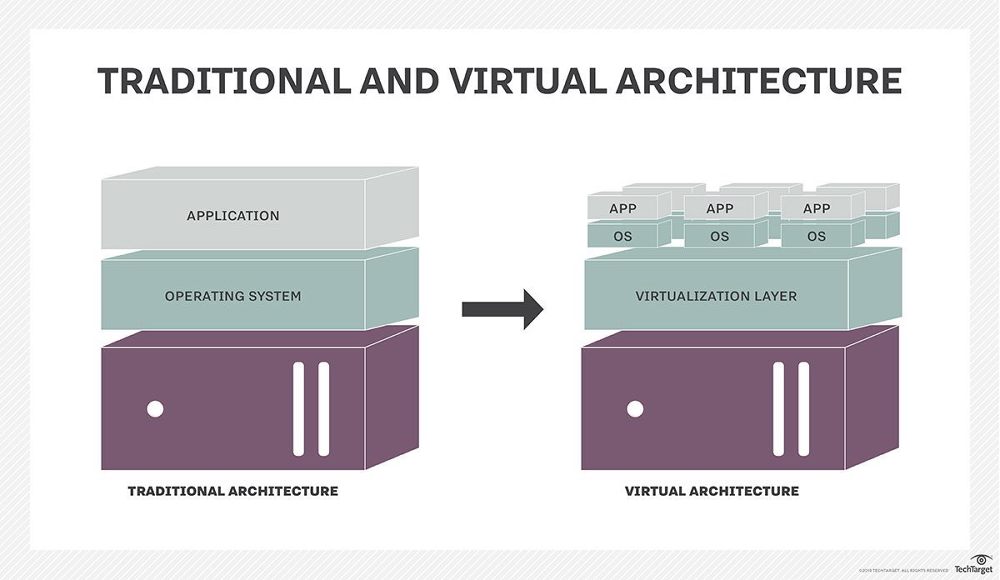
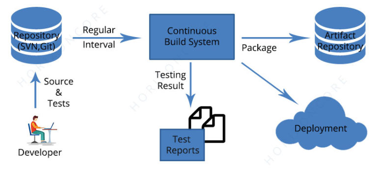
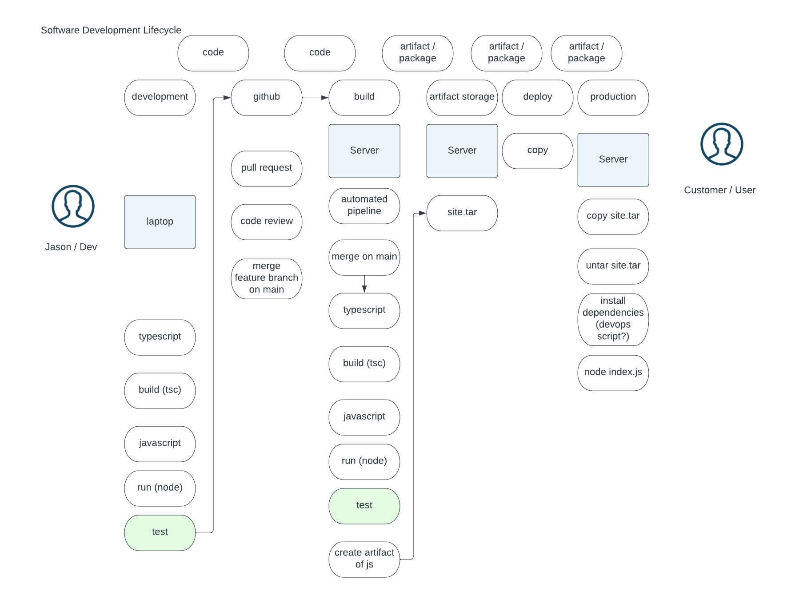

# Pantera

## Notes

6.3.22
Mutable/Immutable

Implicit/ Explicit

REPL -read evaluate print loop all shells are repls

Absolute and Relative - absolute is the whole path from the start of the root

ps command

man -for manual, read the manual

man ps

less -page through files

man less

man zsh

whoami -user of the comp

hostname -name of my comp

$: $ sign is used in the shell to retrieve the value of variables.

echo: echo command is used to print the text or string to the shell or output file.

echo 'hello world'

echo $SHELL

echo $USER

echo $HOME

which ls

which echo

mkdir pantera

nano test.js

cat test.js

man node

node test.js

nano README.md

which git

ls -la

ls .git

rm -r .git

git init

git branch -m main

git remote -v

git push -u origin main

git diff README.md

git push origin main

history

env

 

 
 

# 6.6.2022

strings are arrays of characters
when a string is interpeted you can use \ to escape characters
string literals are not interpreted

folders are directories

cd takes me to home directory

homework:
list all escape characters in javascript and zshell

 

## zsh

escape -double-quotes in double-quotes

escape -$'s in double-quotes

escape -the escape character \

don't escape the single-quotes -- you don't want a literal single-quote, but just group the command into one parameter

## JavaScript

\b -Backspace

\f -Form Feed

\n -New Line

\r -Carriage Return

\t -Horizontal Tabulator

\v -Vertical Tabulator

 

 

# Hypervisor 
also known as a virtual machine monitor or VMM, is software that creates and runs virtual machines (VMs). A hypervisor allows one host computer to support multiple guest VMs by virtually sharing its resources, such as memory and processing.

 
 

# A Virtual Machine (VM) 
is a compute resource that uses software instead of a physical computer to run programs and deploy apps. One or more virtual “guest” machines run on a physical “host” machine. Each virtual machine runs its own operating system and functions separately from the other VMs, even when they are all running on the same host. This means that, for example, a virtual MacOS virtual machine can run on a physical PC.

 
 

# cgroup 
is a mechanism to organize processes hierarchically and distribute system resources along the hierarchy in a controlled and configurable manner. cgroup is largely composed of two parts - the core and controllers. cgroup core is primarily responsible for hierarchically organizing processes. A cgroup controller is usually responsible for distributing a specific type of system resource along the hierarchy although there are utility controllers which serve purposes other than resource distribution. cgroups form a tree structure and every process in the system belongs to one and only one cgroup. All threads of a process belong to the same cgroup. On creation, all processes are put in the cgroup that the parent process belongs to at the time. A process can be migrated to another cgroup. Migration of a process doesn’t affect already existing descendant processes.

 
 

# Virtualization 
is the creation of a virtual -- rather than actual -- version of something, such as an operating system (OS), a server, a storage device or network resources. Virtualization uses software that simulates hardware functionality to create a virtual system. This practice allows IT organizations to operate multiple operating systems, more than one virtual system and various applications on a single server. The benefits of virtualization include greater efficiencies and economies of scale.

 

 curl -L 'https://www.dropbox.com/s/k6xcq55tqanbdmz/countries.txt?dl=0' 

 curl -L 'https://www.dropbox.com/s/k6xcq55tqanbdmz/countries.txt?dl=0' > curlCountries.txt

 curl -L 'https://www.dropbox.com/s/k6xcq55tqanbdmz/countries.txt?dl=0'

 curl -L 'https://www.dropbox.com/s/k6xcq55tqanbdmz/countries.txt?dl=0' | grep United

 man grep
 
 curl -L 'https://www.dropbox.com/s/k6xcq55tqanbdmz/countries.txt?dl=0' | grep "^U"

  

# Big O notation
Big O analogy: Let's say you're making dinner for the family. O is the process of following a recipe, and n is the number of times you follow a recipe. O- you make one dish that everyone eats whether they like it or not. You follow one recipe from top to bottom, then serve (1recipe). <-- How I grew up O(n) - you make individual dishes for each person. You follow a recipe from top to bottom for each person in the family (recipe times the number of people in the family). O(n^2) - you make individual dishes redundantly for every person. You follow all recipes for each person in your family (recipe times the number of people squared). O (log n) - you break people into groups according to what they want and make larger portions. You make one dish for each group (recipe times request)

 
 

## 6.13.22 
print the node version in the pipeline on github

 

## 6.14.22

### entropy- lack of predictability

git checkout -b doze/deploy

git diff

nano deploy.sh

bash deploy.sh

man sudo

git add strings.js deploy.sh

git commit -m 'add deploy script'

## copy file
tar -cf pantera-550f491.tar pantera/ 
 
 

# What is Jira project management?
Jira Software is an agile project management tool that supports any agile methodology, be it scrum, kanban, or your own unique flavor. From agile boards, backlogs, roadmaps, reports, to integrations and add-ons you can plan, track, and manage all your agile software development projects from a single tool.

 

look into dev-ops 
https://www.udemy.com/topic/devops/
 
 

# User story mapping- 

 
 

# Compiled vs. Interpreted Language

 

Compiled Language
* Language is written and compiled to machine code inside of an application
* Errors are detected during compiling
* The code won’t compile until it’s error-free
* Examples: C, C++, Erlang, Go

JavaScript is an Interpreted Language
* Errors found when the code is run
* The interpreter translates and runs code one statement at a time
* Interpreted code runs more slowly

 
 

# How to Build a DevOps Pipeline
 Common steps include establishing a CI/CD tool, sourcing a control environment, setting up a build server, setting up build automation tools for testing, and deploying to production.

 
 

# Step 1: Establish CI/CD Tool
Pick a CI/CD tool based on needs.

 
 

# Step 2: Source a Control Environment
 Source control management tools such as Git allow collaboration with team members, storing code from each developer in a separate shared repository. 

 
 

# Step 3. Set up a Build Server
Setting up a build server, a continuous integration (CI) server, is the next step before a project can make its way down the rest of the pipeline. A build server is a centralized environment for building distributed development projects. Build servers retrieve integrated code from source code repositories, acts as an integration point for developers, and provides an environment to make sure that the code actually works.

 
 

# Step 4. Setup or Build Automation Tools for Testing
Once code is configured on the build server, it is ready to test. Developers run automated tests to ensure that error-free code continues down the pipeline to the deployment stage. Several automated tests are performed at the testing stage including unit, functional, integration, and regression tests. Most tests are run through CI and run one after the other.

 
 

# Step 5. Deploy to Production
Software is ready to be pushed to production. 
Deploy the code by configuring the build server to run a script to deploy the application. This can be set up to run automatically or you can do it manually. Automatic deployment should only be used if you are fully confident that bad code won’t end up in production. You can link this to the test builds, so that the script only runs if all the tests have been passed.

 
 

# What is an artifact server?
An artifact repository stores build artifacts produced by continuous integration and makes them available for automated deployment to testing, staging, and production environments.

Build artifacts are the files created by the build process, such as distribution packages, WAR files, logs, and reports. Artifacts can either be stored in a repository on the CI server, or in an external location available to the CI server.

When you’re committing changes regularly, an automated CI/CD pipeline produces a considerable number of builds each day. The nature of the pipeline means many builds will deploy to the first few environments before an issue is identified, while a smaller number of builds will make it all the way to be released to live.

An artifact repository provides a central location to store those builds, and most expose an API to automatically deploy builds to the environments in the pipeline. As part of the pipeline logic, you can specify how long builds should be kept in the repository and conditions for removing artifacts to free up space.

 
 

 
 

client- log in  -server

secure shell SSH- ip address, 
rsa encryption- public key encryption- making a set of keys, public and private
server has a public key, and I have the private key
generate a key pair, I keep one, and the server keeps the other

 
 

 
 
# RSA 
(Rivest–Shamir–Adleman) is a public-key cryptosystem that is widely used for secure data transmission. It is also one of the oldest. The acronym "RSA" comes from the surnames of Ron Rivest, Adi Shamir and Leonard Adleman, who publicly described the algorithm in 1977. An equivalent system was developed secretly in 1973 at GCHQ (the British signals intelligence agency) by the English mathematician Clifford Cocks. That system was declassified in 1997.[1]

In a public-key cryptosystem, the encryption key is public and distinct from the decryption key, which is kept secret (private). An RSA user creates and publishes a public key based on two large prime numbers, along with an auxiliary value. The prime numbers are kept secret. Messages can be encrypted by anyone, via the public key, but can only be decoded by someone who knows the prime numbers.[2]

The security of RSA relies on the practical difficulty of factoring the product of two large prime numbers, the "factoring problem". Breaking RSA encryption is known as the RSA problem. Whether it is as difficult as the factoring problem is an open question.[3] There are no published methods to defeat the system if a large enough key is used.

RSA is a relatively slow algorithm. Because of this, it is not commonly used to directly encrypt user data. More often, RSA is used to transmit shared keys for symmetric-key cryptography, which are then used for bulk encryption–decryption.

 
 

