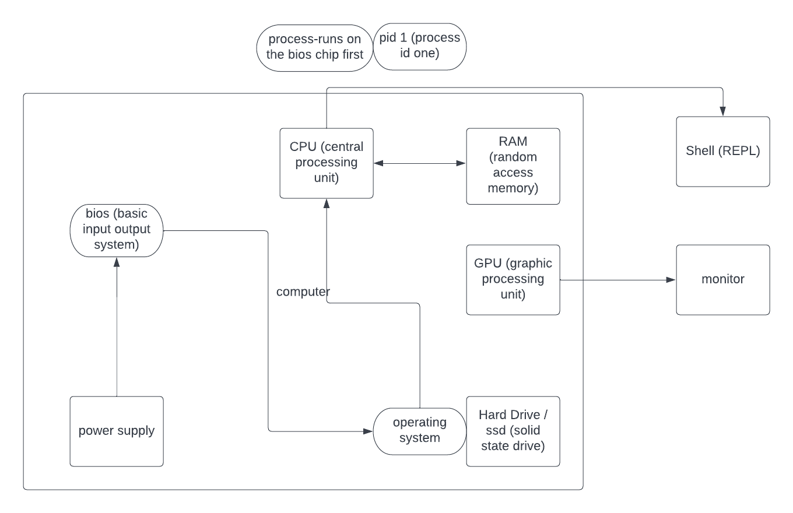

# Pantera

Repo to capture notes on shell programming

## Notes

6.3.22
Mutable/Immutable

Implicit/ Explicit

REPL -read evaluate print loop all shells are repls

Absolute and Relative - absolute is the whole path from the start of the root

ps command

man -for manual, read the manual

man ps

less -page through files

man less

man zsh

whoami -user of the comp

hostname -name of my comp

$: $ sign is used in the shell to retrieve the value of variables.

echo: echo command is used to print the text or string to the shell or output file.

echo 'hello world'

echo $SHELL

echo $USER

echo $HOME

which ls

which echo

mkdir pantera

nano test.js

cat test.js

man node

node test.js

nano README.md

which git

ls -la

ls .git

rm -r .git

git init

git branch -m main

git remote -v

git push -u origin main

git diff README.md

git push origin main

history

env

# 6.6.2022

strings are arrays of characters
when a string is interpeted you can use \ to escape characters
string literals are not interpreted

folders are directories

cd takes me to home directory

homework:
list all escape characters in javascript and zshell

## zsh

escape -double-quotes in double-quotes

escape -$'s in double-quotes

escape -the escape character \

don't escape the single-quotes -- you don't want a literal single-quote, but just group the command into one parameter

## JavaScript

\b -Backspace

\f -Form Feed

\n -New Line

\r -Carriage Return

\t -Horizontal Tabulator

\v -Vertical Tabulator

A hypervisor, also known as a virtual machine monitor or VMM, is software that creates and runs virtual machines (VMs). A hypervisor allows one host computer to support multiple guest VMs by virtually sharing its resources, such as memory and processing.

A Virtual Machine (VM) is a compute resource that uses software instead of a physical computer to run programs and deploy apps. One or more virtual “guest” machines run on a physical “host” machine. Each virtual machine runs its own operating system and functions separately from the other VMs, even when they are all running on the same host. This means that, for example, a virtual MacOS virtual machine can run on a physical PC.

cgroup is a mechanism to organize processes hierarchically and distribute system resources along the hierarchy in a controlled and configurable manner. cgroup is largely composed of two parts - the core and controllers. cgroup core is primarily responsible for hierarchically organizing processes. A cgroup controller is usually responsible for distributing a specific type of system resource along the hierarchy although there are utility controllers which serve purposes other than resource distribution. cgroups form a tree structure and every process in the system belongs to one and only one cgroup. All threads of a process belong to the same cgroup. On creation, all processes are put in the cgroup that the parent process belongs to at the time. A process can be migrated to another cgroup. Migration of a process doesn’t affect already existing descendant processes.

Virtualization is the creation of a virtual -- rather than actual -- version of something, such as an operating system (OS), a server, a storage device or network resources. Virtualization uses software that simulates hardware functionality to create a virtual system. This practice allows IT organizations to operate multiple operating systems, more than one virtual system and various applications on a single server. The benefits of virtualization include greater efficiencies and economies of scale.

 curl -L 'https://www.dropbox.com/s/k6xcq55tqanbdmz/countries.txt?dl=0' 

 curl -L 'https://www.dropbox.com/s/k6xcq55tqanbdmz/countries.txt?dl=0' > curlCountries.txt

 curl -L 'https://www.dropbox.com/s/k6xcq55tqanbdmz/countries.txt?dl=0'

 curl -L 'https://www.dropbox.com/s/k6xcq55tqanbdmz/countries.txt?dl=0' | grep United

 man grep
 
 curl -L 'https://www.dropbox.com/s/k6xcq55tqanbdmz/countries.txt?dl=0' | grep "^U"

 #Big O notation

Here's my favorite Big O analogy: Let's say you're making dinner for your family. O is the process of following a recipe, and n is the number of times you follow a recipe. O- you make one dish that everyone eats whether they like it or not. You follow one recipe from top to bottom, then serve (1recipe). <-- How I grew up O(n) - you make individual dishes for each person. You follow a recipe from top to bottom for each person in your family (recipe times the number of people in your family). O(n^2) - you make individual dishes redundantly for every person. You follow all recipes for each person in your family (recipe times the number of people squared). O (log n) - you break people into groups according to what they want and make larger portions. You make one dish for each group (recipe times request)
